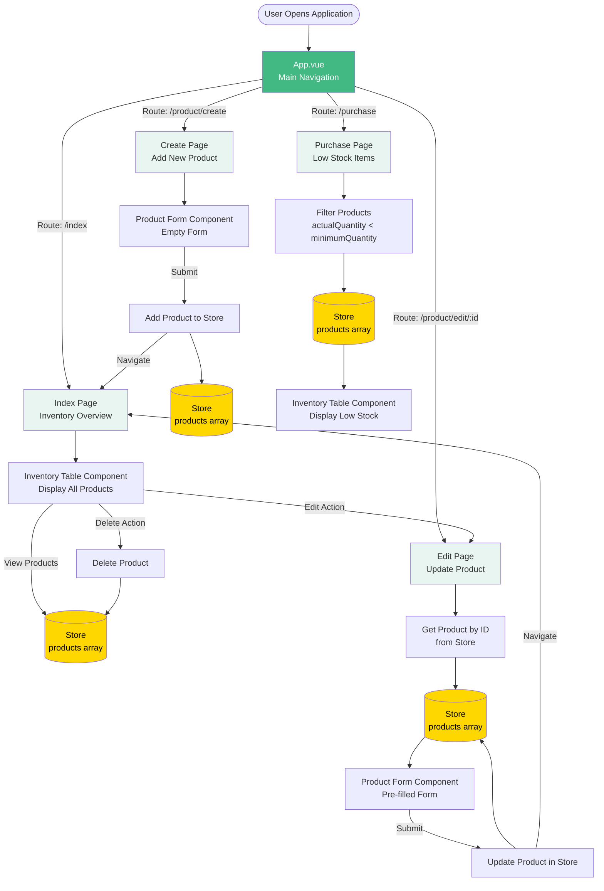
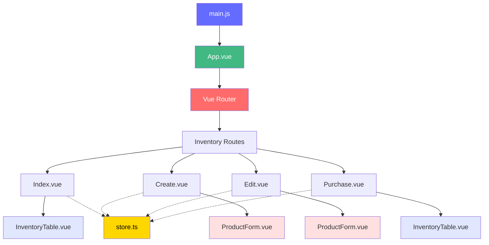
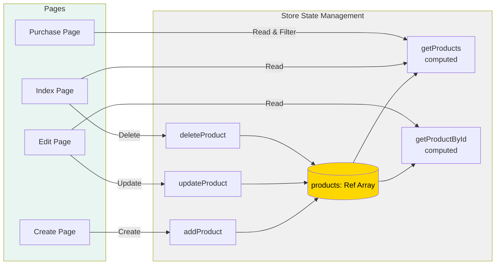
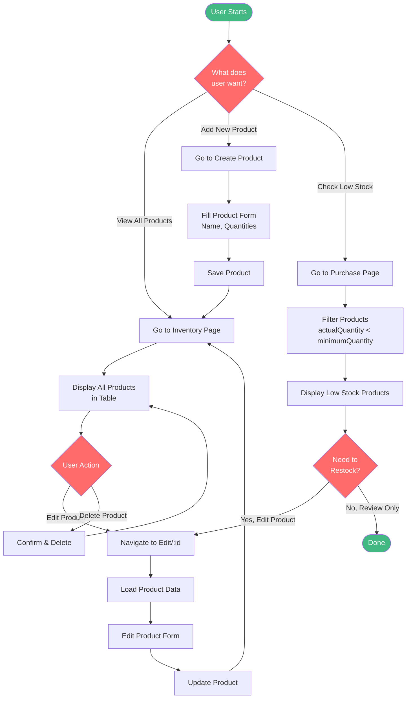

# Inventory Management System - Flowchart

## Application Flow Diagram

```mermaid
flowchart TD
    Start([User Opens Application]) --> App[App.vue<br/>Main Navigation]

    App --> |Route: /index| Index[Index Page<br/>Inventory Overview]
    App --> |Route: /product/create| Create[Create Page<br/>Add New Product]
    App --> |Route: /product/edit/:id| Edit[Edit Page<br/>Update Product]
    App --> |Route: /purchase| Purchase[Purchase Page<br/>Low Stock Items]

    Index --> InventoryTable1[Inventory Table Component<br/>Display All Products]
    InventoryTable1 --> |View Products| Store1[(Store<br/>products array)]
    InventoryTable1 --> |Delete Action| DeleteProduct[Delete Product]
    DeleteProduct --> Store1
    InventoryTable1 --> |Edit Action| Edit

    Create --> ProductForm1[Product Form Component<br/>Empty Form]
    ProductForm1 --> |Submit| AddProduct[Add Product to Store]
    AddProduct --> Store2[(Store<br/>products array)]
    AddProduct --> |Navigate| Index

    Edit --> GetProduct[Get Product by ID<br/>from Store]
    GetProduct --> Store3[(Store<br/>products array)]
    Store3 --> ProductForm2[Product Form Component<br/>Pre-filled Form]
    ProductForm2 --> |Submit| UpdateProduct[Update Product in Store]
    UpdateProduct --> Store3
    UpdateProduct --> |Navigate| Index

    Purchase --> FilterProducts[Filter Products<br/>actualQuantity < minimumQuantity]
    FilterProducts --> Store4[(Store<br/>products array)]
    Store4 --> InventoryTable2[Inventory Table Component<br/>Display Low Stock]

    style App fill:#42b883,color:#fff
    style Store1 fill:#ffd700,color:#000
    style Store2 fill:#ffd700,color:#000
    style Store3 fill:#ffd700,color:#000
    style Store4 fill:#ffd700,color:#000
    style Index fill:#e8f5f0
    style Create fill:#e8f5f0
    style Edit fill:#e8f5f0
    style Purchase fill:#e8f5f0
```

## Component Hierarchy

```mermaid
flowchart TD
    Main[main.js] --> App[App.vue]
    App --> Router[Vue Router]
    Router --> Routes[Inventory Routes]

    Routes --> Index[Index.vue]
    Routes --> Create[Create.vue]
    Routes --> Edit[Edit.vue]
    Routes --> Purchase[Purchase.vue]

    Index --> InventoryTable1[InventoryTable.vue]
    Purchase --> InventoryTable2[InventoryTable.vue]
    Create --> ProductForm1[ProductForm.vue]
    Edit --> ProductForm2[ProductForm.vue]

    Index -.-> Store[store.ts]
    Create -.-> Store
    Edit -.-> Store
    Purchase -.-> Store

    style Main fill:#646cff,color:#fff
    style App fill:#42b883,color:#fff
    style Router fill:#ff6b6b,color:#fff
    style Store fill:#ffd700,color:#000
    style InventoryTable1 fill:#e0e7ff
    style InventoryTable2 fill:#e0e7ff
    style ProductForm1 fill:#ffe0e0
    style ProductForm2 fill:#ffe0e0
```

## Data Flow & Store Operations

```mermaid
flowchart LR
    subgraph Store[Store State Management]
        Products[(products: Ref Array)]

        Products --> GetProducts[getProducts<br/>computed]
        Products --> GetById[getProductById<br/>computed]

        AddAction[addProduct] --> Products
        UpdateAction[updateProduct] --> Products
        DeleteAction[deleteProduct] --> Products
    end

    subgraph Pages[Pages]
        Index[Index Page]
        Create[Create Page]
        Edit[Edit Page]
        Purchase[Purchase Page]
    end

    Index -->|Read| GetProducts
    Index -->|Delete| DeleteAction

    Create -->|Create| AddAction

    Edit -->|Read| GetById
    Edit -->|Update| UpdateAction

    Purchase -->|Read & Filter| GetProducts

    style Products fill:#ffd700,color:#000
    style Store fill:#f0f0f0
    style Pages fill:#e8f5f0
```

## User Journey Flow

```mermaid
flowchart TD
    Start([User Starts]) --> Nav{What does<br/>user want?}

    Nav -->|View All Products| ViewAll[Go to Inventory Page]
    Nav -->|Add New Product| AddNew[Go to Create Product]
    Nav -->|Check Low Stock| CheckStock[Go to Purchase Page]

    ViewAll --> DisplayAll[Display All Products<br/>in Table]
    DisplayAll --> Actions{User Action}
    Actions -->|Edit Product| EditFlow[Navigate to Edit/:id]
    Actions -->|Delete Product| DeleteFlow[Confirm & Delete]
    DeleteFlow --> DisplayAll

    AddNew --> FillForm[Fill Product Form<br/>Name, Quantities]
    FillForm --> SaveNew[Save Product]
    SaveNew --> ViewAll

    EditFlow --> LoadProduct[Load Product Data]
    LoadProduct --> EditForm[Edit Product Form]
    EditForm --> SaveEdit[Update Product]
    SaveEdit --> ViewAll

    CheckStock --> FilterLow[Filter Products<br/>actualQuantity < minimumQuantity]
    FilterLow --> DisplayLow[Display Low Stock Products]
    DisplayLow --> Decision{Need to<br/>Restock?}
    Decision -->|Yes, Edit Product| EditFlow
    Decision -->|No, Review Only| End([Done])

    style Start fill:#42b883,color:#fff
    style End fill:#42b883,color:#fff
    style Nav fill:#ff6b6b,color:#fff
    style Actions fill:#ff6b6b,color:#fff
    style Decision fill:#ff6b6b,color:#fff
```
